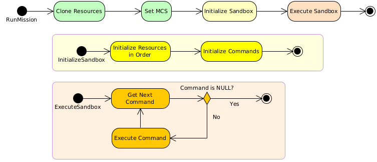

.. _Introduction:

************
Introduction
************
GMAT users working in the GMAT scripting language run the system by configuring a set of objects for the simulation, and then use those objects in an ordered execution sequence - usually set to represent a mission timeline - called the Mission Control Sequence.  The GMAT API developed for releases R2020a and R2022a focused on access to the GMAT objects, and only provided minimal access to the mission sequence.  This document presents a design that makes access to the GMAT commands - the elements of the mission sequence - accessible to the GMAT API users.

GMAT's commands are derived from a single base class, GmatCommand.  The mission sequence is built as a doubly linked list of command objects.  Each command has a pointer to the next command in the sequence, making an orderly flow from command to command easy to manage.  Commands also have a pointer to the previous command to facilitate traversal of the sequence in reverse order.  Some commands have the ability to branch flow through the sequence, enabling loops and conditional execution.  This branching capability is used for traditional programming capabilities and for iterative processes like targeting and optimization.  Commands perform actions through the Execute() method implemented for the command.  The basic flow of command execution in the GMAT Sandbox is shown in :numref:`RunScript`.  

.. _RunScript:

	Sequence of Actions when a Script is Run

API users have more flexibility when working with GMAT commands.  The command interface lets users run individual commands or sequences of commands through calls to the GMAT API.  This flexibility is built into a set of API commands implemented in the R2024a development cycle, as described in :ref:`TopLevelInterface`.  Use of this interface to run a single command is described in :ref:`Commands`.  Execution of a sequence is described in :ref:`CommandSequences`.  Several use cases are described in :ref:`Examples`.
